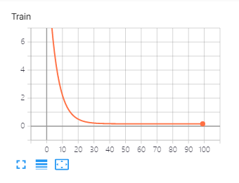

# 11.1.1 训练监控

tensorboard一个最方便实用的功能就是监控训练的loss以及各种相关指标，让我们随时直观的掌握模型的状态，调整训练策略。

本小节给出一个非常简单的demo，通过构造一个简易的线性回归训练，来介绍如何通过tensorboardX监控并可视化训练的进展。

直接看代码：

```python
import torch
import torch.nn as nn
from tensorboardX import SummaryWriter
import matplotlib.pyplot as plt
import numpy as np

input_size = 1
output_size = 1
num_epoches = 100
learning_rate = 0.001
writer = SummaryWriter(comment='Linear')
x_train = np.array([[3.3], [4.4], [5.5], [6.71], [6.93], [4.168],
                    [9.779], [6.182], [7.59], [2.167], [7.042],
                    [10.791], [5.313], [7.997], [3.1]], dtype=np.float32)
y_train = np.array([[1.7], [2.76], [2.09], [3.19], [1.694], [1.573],
                    [3.366], [2.596], [2.53], [1.221], [2.827],
                    [3.465], [1.65], [2.904], [1.3]], dtype=np.float32)

model = nn.Linear(input_size, output_size)

criterion = nn.MSELoss()
optimizer = torch.optim.SGD(model.parameters(), lr=learning_rate)

for epoch in range(num_epoches):
    inputs = torch.from_numpy(x_train)
    targets = torch.from_numpy(y_train)

    output = model(inputs)
    loss = criterion(output, targets)

    optimizer.zero_grad()
    loss.backward()
    optimizer.step()

    # 保存loss的数据与epoch数值
    writer.add_scalar('Train', loss, epoch)

    if (epoch + 1) % 5 == 0:
        print('Epoch {}/{},loss:{:.4f}'.format(epoch + 1, num_epoches, loss.item()))

writer.close()
```

运行上面代码，并启动tensorboard：

```
$ python linear_regression.py
$ tensorboard --logdir runs --bind_all
```

在浏览器输入ip:port即可查看训练的可视化信息:

```
ip:6006
```


